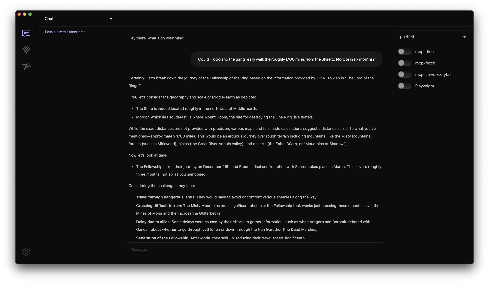

    <code>A magical tool for using local LLMs with MCP servers</code>

---

# Introducing Tome

Tome is a MacOS app (Windows and Linux support coming soon) designed for working with local LLMs and MCP servers, built by the team at [Runebook](https://runebook.ai). Tome manages your MCP servers so there's no fiddling with uv/npm or json files - connect it to Ollama, copy/paste some MCP servers, and chat with an MCP-powered model in seconds.

This is our very first Technical Preview so bear in mind things will be rough around the edges. Since the world of MCP servers and local models is ever-shifting (read: very janky), we recommend [joining us on Discord](https://discord.gg/9CH6us29YA) to share tips, tricks, and issues you run into. Also make sure to star this repo on GitHub to stay on top of updates and feature releases.

# Getting Started

## Requirements

- MacOS (Sequoia 15.0 or higher recommended)
- [Ollama](https://ollama.com/) (Either local or remote, you can configure any Ollama URL in settings)
- [Download the latest release of Tome](https://github.com/runebookai/tome/releases/download/v0.3.0/Tome_0.3.0_aarch64.dmg)

## Quickstart

We'll be updating our [home page](https://runebook.ai) in the coming weeks with docs and an end-to-end tutorial, here's a quick getting started guide in the meantime.

1. Install [Tome](https://github.com/runebookai/tome/releases/download/v0.3.0/Tome_0.3.0_aarch64.dmg) and [Ollama](https://ollama.com)
2. Install a [Tool supported model](https://ollama.com/search?c=tools) (we're partial to [Qwen3](https://ollama.com/library/qwen3), either 14B or 8B depending on your RAM)
3. Open the MCP tab in Tome and install your first [MCP server](https://github.com/modelcontextprotocol/servers) (Fetch is an easy one to get started with, just paste `uvx mcp-server-fetch` into the server field)
4. Chat with your MCP-powered model! Ask it to fetch the top story on Hacker News.

# Vision

We want to make local LLMs and MCP accessible to everyone. We're building a tool that allows you to be creative with LLMs, regardless
of whether you're an engineer, tinkerer, hobbyist, or anyone in between.

## Core Principles

- **Tome is local first:** You are in control of where your data goes.
- **Tome is for everyone:** You shouldn't have to manage programming languages, package managers, or json config files.

## What's Next

- Model support: Currently Tome uses Ollama for model management but we'd like to expand support for other LLM engines and possibly even cloud models, let us know if you have any requests.
- Operating system support: We're planning on adding support for Windows, followed by Linux.
- App builder: we believe long term that the best experiences will not be in a chat interface. We have plans to add additional tools that will enable you to create powerful applications and workflows.
- ??? Let us know what you'd like to see! Join our community via the links below, we'd love to hear from you.

# Community

[Discord](https://discord.gg/9CH6us29YA) [Bluesky](https://bsky.app/profile/runebook.ai) [Twitter](https://twitter.com/runebookai)
